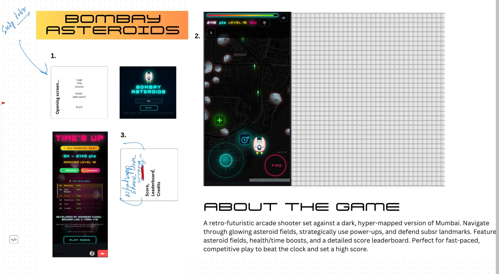

---
hide:
  - toc
---

# Bombay Asteroids

  HTML5 Canvas
  JavaScript
  Firebase
  PWA
  Web Audio API

A retro arcade shooter set above Mumbai — pilot your spaceship through 10 iconic city landmarks, destroy incoming asteroids, and race for the top of a live global leaderboard. Built entirely in vanilla JavaScript with zero dependencies.

[🎮 Play Now](https://somdeepkundu.github.io/bombay-asteroids/){ .md-button .md-button--primary target="_blank" }
[📂 Source Code](https://github.com/somdeepkundu/bombay-asteroids){ .md-button target="_blank" }

---

## Features

### :material-gamepad-variant: Gameplay
Navigate through 10 iconic Mumbai landmarks from IIT Bombay to the Gateway of India. Each level introduces faster waves and denser asteroid fields.

### :material-trophy: Live Leaderboard
Real-time global leaderboard powered by Firebase Firestore. Your score is saved instantly — compete with players worldwide.

### :material-cellphone: Plays Everywhere
Fully responsive across desktop, tablet, and mobile. Installable as a Progressive Web App — plays offline with no download required.

### :material-lightning-bolt: Performance
Maintains 60 FPS on desktop and 30 FPS on budget phones. Lightweight audio engine built on the Web Audio API — no external assets.

---

## Technical Details

| | |
|---|---|
| **Renderer** | HTML5 Canvas 2D API — frame-by-frame game loop |
| **Architecture** | Pure vanilla JS — zero libraries, zero build step |
| **Backend** | Firebase Firestore for real-time leaderboard sync |
| **Offline support** | Service Worker + PWA manifest |
| **Performance** | RequestAnimationFrame loop, delta-time physics |
| **Privacy** | No ads, no analytics, no third-party tracking |

---

[← Back to All Projects](index.md)
