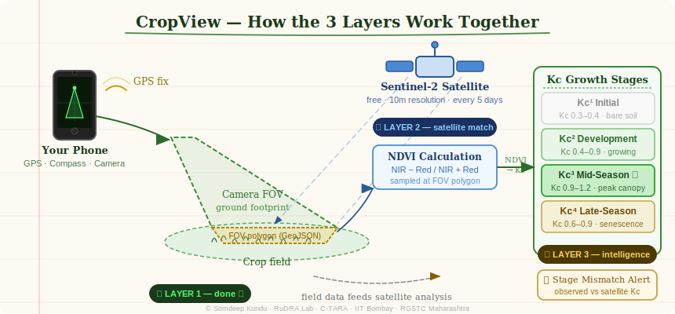

# 🌿 CropView

**Point your phone at a crop. Capture its location, direction and field of view. Match it with satellite data.**

A free, open-source mobile web app for field researchers and agronomists — no installation, runs straight in your phone browser.

---



---

## What does it do?

You walk into a field, open the app, and point your camera at the crop. CropView records:

- 📍 **Where you are** — GPS coordinates
- 🧭 **Which way you're pointing** — compass heading
- 📐 **What your camera sees on the ground** — a polygon drawn live on the map
- 🌱 **What growth stage the crop is in** — based on FAO-56 Kc values

Everything gets saved and exported as a **GeoJSON file**, ready to be matched against satellite imagery.

---

## Why does it matter?

Satellite images cover huge areas but can't tell you what's actually happening on the ground on a specific day. This app creates a **bridge** — a precise geo-tagged photo with metadata that can be compared to what Sentinel-2 saw from space on the same date.

Eventually (Layer 2 & 3), the app will do that comparison automatically and flag if your crop's growth stage doesn't match what the satellite data suggests.

---

## The 3-Layer Plan

| Layer | What it does | Status |
|---|---|---|
| **Layer 1** | Field capture — GPS, compass, FOV polygon, Kc tagging | ✅ Live |
| **Layer 2** | Pull Sentinel-2 imagery, compute NDVI at your capture location | 🔜 Next |
| **Layer 3** | Compare observed Kc stage vs satellite-derived stage, raise alerts | 🔜 Planned |

---

## How to use it

1. Open **[somdeepkundu.github.io/cropview](https://somdeepkundu.github.io/cropview)** on your phone
2. Allow camera, GPS and compass when asked
3. Give your survey session a name
4. Go outside, point at a crop, tap **◉ CAPTURE**
5. Tag the growth stage (Kc¹ to Kc⁴)
6. Export as **ZIP** — includes geocoded images, GeoJSON footprints and CSV

---

## What's in an export?

```
YourProject_CropView_2026-05-15.zip
├── images/
│   └── YourProject_CV-123_20260515_19p134_72p905.jpg
├── data/
│   ├── YourProject_captures_points.geojson
│   ├── YourProject_captures_footprints.geojson
│   └── YourProject_captures.csv
└── README.txt
```

The **footprints GeoJSON** contains the actual ground polygons of what your camera saw — these are what get matched to satellite pixels in Layer 2.

---

## The 4 Kc Growth Stages (FAO-56)

| Stage | Name | Kc range | What you see |
|---|---|---|---|
| Kc¹ | Initial | 0.3 – 0.4 | Bare soil, seedlings just emerging |
| Kc² | Development | 0.4 – 0.9 | Leaves growing, canopy filling in |
| Kc³ | Mid-Season | 0.9 – 1.2 | Full canopy, peak growth |
| Kc⁴ | Late-Season | 0.6 – 0.9 | Yellowing, ripening, near harvest |

---

## Tips for good captures

- 📡 Go **outside** for accurate GPS and compass
- 📐 Hold the phone at a **30°–50° tilt** — the tilt guide on screen will tell you
- 🌤 Capture on **clear days** when satellite images are also likely cloud-free
- 🌱 Select your **Kc stage before capturing**, not after

---

## Built with

- [Leaflet.js](https://leafletjs.com) — maps
- [Turf.js](https://turfjs.org) — ground footprint geometry
- [JSZip](https://stuk.github.io/jszip/) — export packaging
- [Sentinel-2](https://sentinel.esa.int) — satellite data (Layer 2, coming soon)
- GitHub Pages — free hosting

---

## About

Developed by **Somdeep Kundu**
PhD Research Scholar · Rural Data Research and Analysis Lab (RuDRA)
Centre for Technology Alternatives for Rural Areas (C-TARA) · **IIT Bombay**

For the **RGSTC Project** — Rajiv Gandhi Science & Technology Commission, Maharashtra Government.

🌐 [somdeepkundu.github.io](https://somdeepkundu.github.io)

---

*© 2026 Somdeep Kundu · MIT License*
