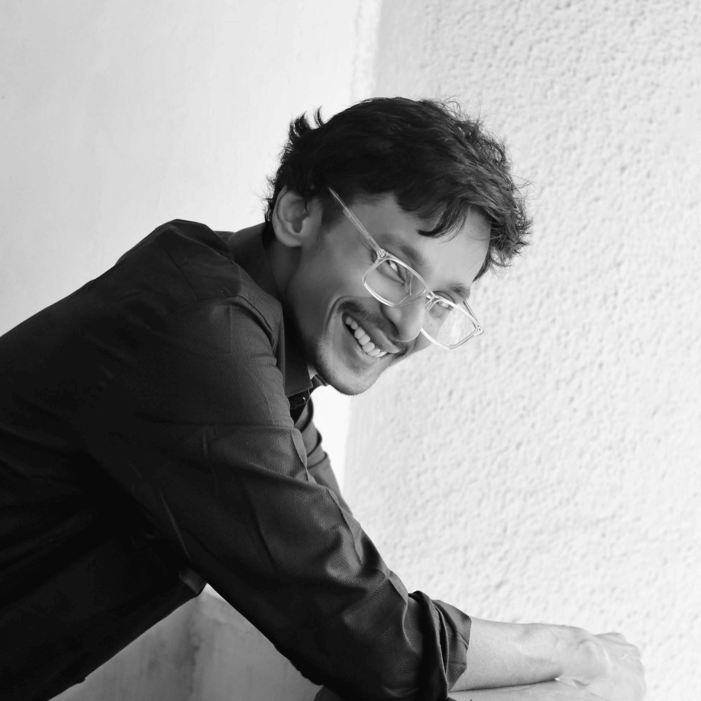
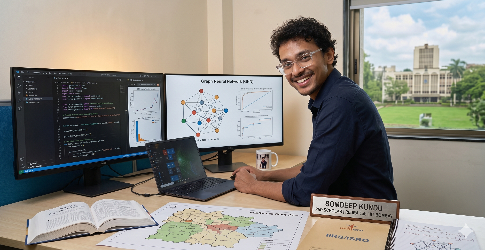

---
hide:
  - toc
---

  
  

    <h1>Somdeep Kundu</h1>
    
<strong>PhD Scholar, IIT Bombay | RuDRA Lab, C-TARA</strong>

    
<em>Generalised Abstract Spatio-temporal madness</em>

  

---

## About Me

I am a PhD Scholar at the Centre for Technology Alternatives for Rural Areas (C-TARA) at Indian Institute of Technology, Bombay, and an active member of the RuDRA (Rural Data Research Analysis) Lab. Building on my background in Civil Engineering and a PG diploma in Disaster Management with Remote Sensing & GIS from IIRS, ISRO, my work addresses agricultural water optimization for rural Maharashtra. My methodology centers on field-operationalizable approaches and site-specific hydrological modeling rather than purely theoretical machine learning. By integrating ancient agrometeorology with multimodal satellite data (such as NISAR and Sentinel) and multi-temporal ground-truthing, I utilize Python, QGIS, and Google Earth Engine to translate complex geospatial data into actionable rural applications.

  
  
<a href="https://somdeepkundu.github.io/assets/files/IndiaAI-ImpactSummit-Somdeep.pdf" target="_blank">See poster</a>

---

[View My Projects :material-arrow-right:](projects/index.md){ .md-button .md-button--primary }
[Download CV :material-download:](assets/Somdeep-Kundu-CV.pdf){ .md-button }

---

## Skills

-   :material-layers:{ .lg .middle } **GIS & Remote Sensing**

    ---

    - Google Earth Engine, QGIS
    - GDAL / OGR — Drone data spatial analysis with open-source tools
    - STAC API for satellite data integration
    - DGCA-approved certified drone pilot (Rotorcraft, VLOS, Small)

-   :material-code-braces:{ .lg .middle } **Programming**

    ---

    - Python — Machine Learning & Automation
    - R — Spatial Data Analysis
    - JavaScript — Web mapping & GEE
    - HTML, CSS — Web Development
    - Natural Language / Vibe Coding — Agentic Workflow
    - Parallel processing using Dask and XArray

-   :material-star-four-points:{ .lg .middle } **Machine Learning & GeoAI**

    ---

    - Linear Algebra, Bayesian Statistics
    - Classical and non-Markovian hybrid approach
    - Post-classification accuracy assessment
    - Time-series spatial data processing and gap filling
    - Foundational Model (Alpha Earth)
    - Graph Neural Networks (GNN), Knowledge Graph
    - Sustainable and Trustworthy AI
    - Chaos Theory applications in agrometeorology

-   :material-earth:{ .lg .middle } **Web Mapping & Applications**

    ---

    - Streamlit for data-driven web apps and dashboards
    - Interactive web-based application development
    - Integrating indigenous knowledge systems with spatial data
    - Remote sensing visualization

---

## Connect

[GitHub](https://github.com/somdeepkundu){ .md-button }
[LinkedIn](https://linkedin.com/in/somdeep-kundu){ .md-button }
