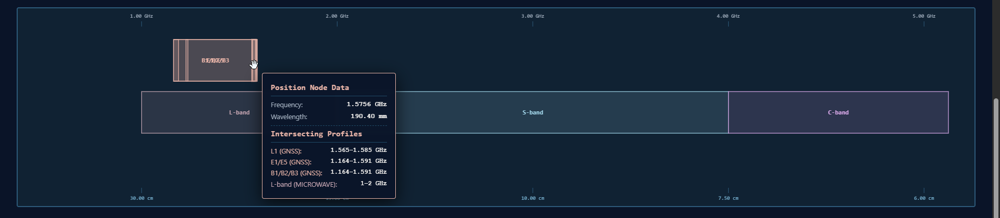

---
hide:
  - toc
---
# Electromagnetic Spectrum

## Overview
An interactive zoomable visualization of the electromagnetic spectrum focusing on satellite navigation and microwave bands. Explore GNSS constellations (GPS, GLONASS, Galileo, BeiDou, NavIC) across L, C, Ku, and Ka bands with real-time frequency-wavelength calculations and constellation details.

## Details
- **Technologies**: Interactive Visualization, Web Technologies, Geospatial, GNSS
- **Purpose**: Electromagnetic spectrum education and GNSS band visualization
- **Features**: 
  - Interactive zoomable spectrum view (1 GHz to 40 GHz)
  - Real-time frequency-wavelength conversion
  - GNSS constellation focus cards
  - Multi-band analysis (L, C, Ku, Ka)
  - Physical size references with wavelength data
  - Auto-focus on constellation selection

## Frequency Coverage
Covers microwave bands L through Ka, from ~1 GHz (30 cm wavelength) to ~40 GHz (7.5 mm wavelength), including all major GNSS bands used by:
- **GPS (NavSTAR)** – United States
- **GLONASS** – Russian Federation
- **Galileo** – European Union
- **BeiDou** – China
- **NavIC (IRNSS)** – India

## Key Features
### Interactive Navigation
Scroll with your mouse wheel or pinch your trackpad to zoom directly into frequency nodes. Drag to pan left or right. Click on any band or constellation card to auto-focus the spectrum view.

### Wavelength Verification
All wavelengths calculated using $f \times \lambda = c$ (where c = 300,000 km/s):
- L-band @ 1.575 GHz: λ = 19 cm
- C-band @ 6 GHz: λ = 5 cm
- Ku-band @ 15 GHz: λ = 2 cm
- Ka-band @ 33.25 GHz: λ = 9 mm

### Physical References
Includes spectrum allocation zones and high-density processing arrays with accurate physical size representations.

## Standards & References
- **ITU-R V.431** – Radio frequency classifications for aerospace networks
- **IEEE 521-2002** – Standard letter designation schemas for hardware and radar-frequency allocations
- Frequencies and wavelengths verified against GPS/GLONASS/Galileo/BeiDou/NavIC User Spatial Interface Control Documents

## Links
[Launch App →](https://somdeepkundu.github.io/Spectrum/){ .md-button } [View Source →](https://github.com/somdeepkundu){ .md-button }

---

Made by [Somdeep Kundu](https://somdeepkundu.github.io/) with ❤️ at RuDRA Lab, C-TARA, IIT Bombay
