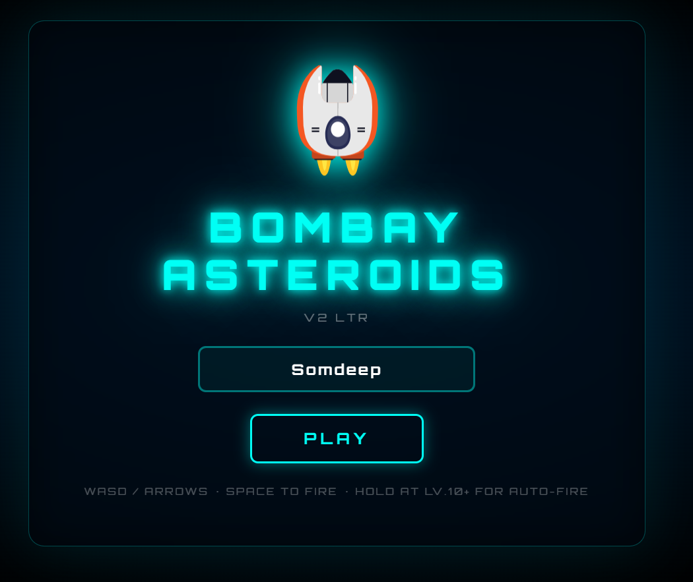
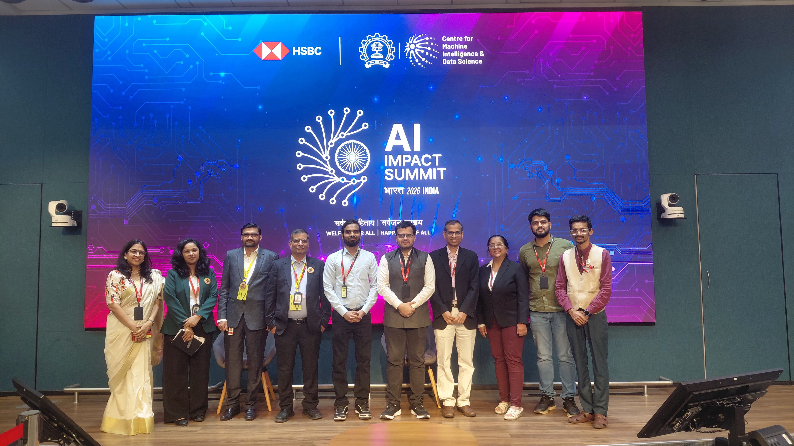

---
hide:
  - toc
---

# Projects

A selection of my geospatial and AI projects. Click any card to explore.

**[Bombay Asteroids](bombay-asteroids-gallery.md)**

A high-octane arcade shooter with procedural difficulty scaling. Pilot your spaceship above Mumbai, dodge and destroy asteroids with real-time leaderboard tracking!

`HTML5` `Canvas` `Web Audio` `Firestore` `PWA`

[View Project →](bombay-asteroids-gallery.md){ .md-button }

**[India AI Impact Summit 2026](../assets/files/IndiaAI-ImpactSummit-Somdeep.pdf)**

Participated in 3 pre-summit events. Selected for HSBC Pune's Deccan Digital Dialogue on AI, Talent, and the GCC Ascent. Presented research poster at IIT Bombay on Conclave for AI in Science (Jan 8, 2026).

`AI Research` `India AI` `HSBC` `IIT Bombay`

[View Poster →](../assets/files/IndiaAI-ImpactSummit-Somdeep.pdf){ .md-button }

